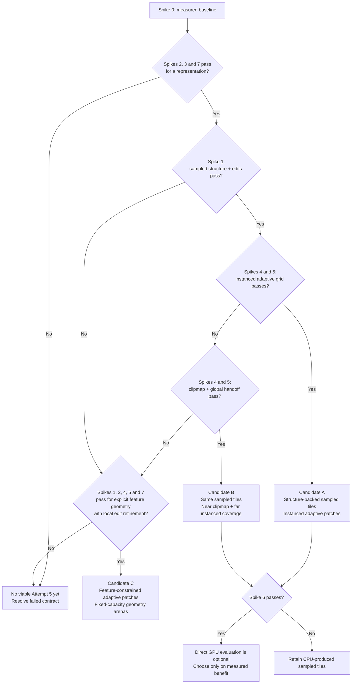

# 028 — Planetary Terrain: Complete Attempt History (pre-work for attempt #5)

## Status

- State: **Gathering doc only — no design decisions made here.** Inventory of every terrain/LOD attempt to date, what each achieved, what killed it, and what is still unresolved. Written before any attempt #5 design discussion so that the next proposal has to argue against the full record, not against a memory of it.
- Date: 2026-09-05
- Inputs: BSP `docs/` (runbooks 15/16/20, case studies 007/014/015/019, v3-planning 01/03/09, deep-research report), BSP code (`projects/worlds`, `graphics-settings.service.ts`, `in-game-celestial-body.component`), triangular-workspace runbooks (004/019/022), engine code (`terrain/`, `terrain/cdlod/v3/`, `worldgen/`), and Bruno's first-hand symptom reports (2026-09-05).

## Why this doc exists

Four distinct architectures have been built for planetary terrain. All four work well enough to demo; none has survived contact with the actual game at real planet scale. The three named pain points going into attempt #5:

1. **Cubesphere quadtree (attempt 1)** — high draw calls in-game; seams at LOD boundaries and cube-face edges.
2. **CDLOD (attempt 2)** — _the highest_ draw calls of all versions in-game (worse than attempt 1), plus an unresolved full-ground flicker and low FPS while standing still near the ground.
3. **V4 Voronoi cell planet (attempt 4)** — super low performance in the lab.

The purpose of gathering first: every past attempt optimized a different thing (seams → draw calls → structure-first worldgen), each was superseded rather than completed, and several documented performance claims were never confirmed by in-game measurement (case study 007's central lesson). Attempt #5 should start from the failure record, not from a fresh architecture sketch that repeats one of these.

## Requirements for attempt #5 (goals, not design)

Stated here as targets to satisfy, not as an architecture choice — nothing below picks a solution.

- **Scale range, not a fixed radius.** BSP `plans/world-size-presets.md` (2026-07-29, Bruno-ranked top priority of that session, still unscheduled) commits to six Earth-radius-fraction tiers from ~6km ("mini") to Earth-and-beyond ("extra-large") sharing one terrain system. Every number in this doc — attempt 1's 300–800 draw calls, attempt 2's claimed 12–30, attempt 4's ~2–30 — was produced (or claimed) at one fixed home-planet scale. None has ever been tested across a 1000×+ radius range. Attempt #5 should state which scales it targets, not assume "planetary" means "today's one planet."
- **Runtime-modifiable, at more than one granularity.** Attempt 4 solved this at landscape/cell scale (sparse `Map<cellId, elevation>` override + affected-chunk rebuild). Nothing has solved it at building/base scale — attempt 4's own resolution floor (≥0.5km/cell at max density) is the documented gap (see Attempt 4 below).
- **LOD close and far, as two separable problems.** Far: only attempt 2 has a measured/derived horizon-cull formula; attempt 4 has none (no visibility culling implemented at all). Close: geometric LOD (this doc's main subject) is one axis; visual/texture fidelity at close range is a _separate_, already-partly-designed track — see the Debate B clarification and `terrain-detail-texturing.md` note added to Attempt 1 below. Conflating the two axes is how attempt 1's uniform-density bug (S1) happened.
- **Low draw calls, with an actual target number.** The only measured (not claimed) low number in the whole record is attempt 4's ~2–3 draw calls at default density / ~30 at max. Attempt #5 should say what count it's aiming for and at what camera distance, rather than "fewer than before."
- **A performance budget, stated explicitly.** No doc in either repo states a target frame time or FPS for any hardware tier, for any attempt, ever (this is Open Question 1's premise, restated as a requirement rather than a question). Attempt #5's proposal should either get an explicit budget from Bruno or state the assumed one — "better than attempt N" is not a budget.

## Naming disambiguation (read before any discussion)

The label "V1/V2/V3" means **three different things** across the two repos. This doc uses **attempt numbers 1–4** exclusively.

| Label | In BSP `v3-planning/`                                                                           | In runbook 022                                   | In `terrain/cdlod/` code      |
| ----- | ----------------------------------------------------------------------------------------------- | ------------------------------------------------ | ----------------------------- |
| V1    | The first _game_ (Nov 2024–Feb 2026), stalled; its two terrain prototypes were never integrated | (not used)                                       | —                             |
| V2    | `src/app/falling-shapes` restart (Sep–Nov 2025), abandoned                                      | (not used)                                       | —                             |
| V3    | The current game restart (July 2026 →)                                                          | "V1–V3 = the noise-first planet attempts in BSP" | `engineVersion` input default |
| V4    | —                                                                                               | The Voronoi cell planet (attempt 4 below)        | the newer selector variant    |

So Bruno's "1st cubesphere / 2nd cdlod / 3rd cell planet" maps to **attempts 1, 2, 4** here (attempt 3 is the quieter engine port of attempt 1's architecture).

## Timeline overview

| #   | Attempt                                                                                    | Lives in                                    | Era                     | Status                                                | Headline outcome                                                                                                            |
| --- | ------------------------------------------------------------------------------------------ | ------------------------------------------- | ----------------------- | ----------------------------------------------------- | --------------------------------------------------------------------------------------------------------------------------- |
| 1a  | V1 prototypes (`procedural-terrain`, `spherical-procedural-terrain`, `planet-noise-baker`) | deleted (BSP V1 repo)                       | 2024–2026               | dead                                                  | Never integrated into the game; harvested for projection/noise learnings                                                    |
| 1b  | Cubesphere quadtree, production (`@daxur-studios/worlds`)                                  | BSP `projects/worlds`                       | July–Aug 2026           | **live as fallback** (`useCdlodTerrain` toggle)       | Works end-to-end incl. Jolt colliders; seams + 300–800 draw calls + 1.1M tris                                               |
| 1c  | `THREE.BatchedMesh` experiment                                                             | BSP                                         | Aug 2026                | **reverted**                                          | Draw calls 1–2 but broke ring shadows, grazing-angle disappearing, memory churn (case study 015)                            |
| 2a  | CDLOD lab → engine migration                                                               | TW `terrain/cdlod/`                         | Aug 2026                | **live as default** (`useCdlodTerrain` defaults true) | Highest in-game draw calls of all attempts; unresolved flicker (case study BSP-019)                                         |
| 2b  | CDLOD "v3" selector + instanced renderer                                                   | TW `terrain/cdlod/v3/`                      | after 019               | merged, undated, **no runbook**                       | Feature-pyramid selector, silhouette/coastline weighting, GPU instanced renderer — exists only as an `engineVersion` toggle |
| 3   | Multi-surface terrain port (plane/sphere/cylinder)                                         | TW `terrain/core,domains,meshing,streaming` | July 2026 (runbook 004) | parked mid-parity                                     | Attempt-1 architecture re-port; BSP remained the reference path                                                             |
| 4   | V4 Voronoi cell planet (`worldgen`)                                                        | TW `worldgen/` + labs                       | Aug 2026 (runbook 022)  | **M0–M4e done, M5 (decision) pending**                | Structure-first worldgen proven; rendering = chunked cell mesh, super low performance per Bruno; never integrated           |

---

## Attempt 1 — Cubesphere quadtree (the "seams" version)

**Where:** BSP `projects/worlds` (`quadtree-selection.ts`, `patch-mesher.ts`, `patch-heightfield.ts`, `patch-scheduler.ts`), rendered by `PlanetPatchRendererComponent` / `InGameCelestialBodyComponent`. Design contract in BSP `v3-planning/03_hard-problems.md` (§Terrain), implementation plans in `plans/terrain-foundation.md` / `phase-7-terrain-landing.md`.

**Architecture:** 6 cube faces → gnomonic projection to sphere → per-face quadtree of patches addressed `(face, level, x, y)`. One shared `height(dir)` function is the single source of truth for both visual mesh and Jolt collider. Patch-local f32 vertices anchored to double-precision patch centers. Skirts (vertical flanges) hide cracks instead of index-buffer stitching. Worker meshing with 0-copy transferables. Jolt `MeshShape` colliders streamed near the vessel only.

### What it got right (still the best physics story of all attempts)

- **Visual/physics coincidence by construction** — one `height()` feeds both surfaces. None of the later attempts has a better answer; attempts 2 and 4 both re-solve this (CDLOD keeps BSP's separate collider streamer; V4 samples colliders from `sampleElevation()`).
- Ready-tree promotion (a parent only splits once all 4 children are cached) → zero black holes.
- Collider streaming policy (`TerrainColliderStreamer`: budgeted builds, critical-footprint bypass, build-new-before-destroy-old) — runbook 022 explicitly calls this "a battle-tested pattern worth reusing as-is."
- Patch-local precision + floating-origin rebasing survived real flight (with the case-study fixes below).

### Documented failure symptoms

From BSP case study 007 (all traced to lines, none fixed at time of writing except S2 later):

- **S1 — uniform density:** `estimatePlanetPatchGeometricErrorM` uses the body's _global_ elevation span → flat meadow and mountain ridge subdivide identically → **1.1M+ triangles** while looking flat. The fix (measured per-patch residual) was designed twice (case study 007 §3, runbook 15 Phase 3, deep-research report) and **never landed**.
- **S2 — inverted streaming order:** one-line priority bug (`-level` sorts coarse-first); ground under the vessel arrived last.
- **S3 — visual/Jolt mismatch:** the visual mesher samples a cube-face UV lattice, the heightfield resamples to a tangent-plane XZ lattice → surfaces cross; vessel sits slightly underground. Structural, never resolved.
- **S4 — unexplained low-detail rectangle** on the near face. Never reproduced.
- **Seams (Bruno's headline complaint):** skirts fail at grazing angles and across cube-face edges (runbook 15 §C); CDLOD was partly invented to retire skirts.
- **Draw calls: 300–800/frame** (150–400 resident patches × surface + skirt meshes). Surface+skirt buffer merge halved it to ~100–150 — the one shipped optimization.

### Failed fixes — do not re-attempt (runbook 15 §7, case study 015)

1. **`THREE.BatchedMesh`** — draw calls dropped to 1–2 but: ring shadows severed (`modelMatrix` is the container's, per-instance transforms live in an internal texture custom shaders don't read), whole planet culls away at grazing angles (zero-radius bounding sphere of the dummy container geometry; `perObjectFrustumCulled` breaks on floating-origin coordinates), and streaming churn (dead ranges until `optimize()` → megabyte-scale `copyWithin`). Permanent rule in case study 015.
2. **Unbounded patch-wide sagitta multiplier** in the error metric — draw calls exploded 30 → 1,273 at mid-altitudes.
3. **Camera world-direction frustum culling computed in body-fixed space** — frame mismatch deleted visible terrain.
4. Also (case study 014): per-frame `MeshStandardMaterial` allocation in Angular effects + mass shader compilation on terrain mount caused a **1-second spawn lockup**.

### The three design debates (proposals, never executed)

BSP `v3-planning/09_terrain-lod-approach-comparison.md` (2026-08-06) — three independent agent proposals:

- **A — measured-residual error metric + pinned-perimeter interior density** on the existing quadtree. Honest limit stated in the doc: interior density changes _triangles per patch_, never patch count → **does not move draw calls**.
- **B — texture-relief LOD** (the already-built-but-unwired per-patch texture bake `bakePlanetPatchTexture` in `planet-patch-texture-baker.ts`) to buy shading detail so geometric thresholds can relax. Blocked on rewriting the baker (~325k unbatched sampler calls per bake) and on A landing first. **Do not confuse this with `createPlanetSurfaceTextures` (`planet-surface-textures.ts`)** — a separate, _live_, whole-sphere synchronous bake with the documented ~6s blank-screen lag (agent memory `feedback-baked-texture-perf`). B proposes reviving the unwired per-patch baker, not the slow whole-sphere one; BSP `plans/planet-surface-texture.md` (P0–P2 implemented, pending visual accept) is a third, further-along track using the whole-sphere baker for a different surface (not the LOD terrain patches) — three distinct baking code paths exist, easy to conflate.
- **B-continued — `plans/terrain-detail-texturing.md`** (design capture, parked 2026-07-28): Unreal-landscape-style multi-scale detail-map blending over baked patch albedo for close-range depth/motion cues, biome-driven via `sampleBiome`. Waits on the flight-view patch pipeline's accept gate. This is close-range _visual_ fidelity, decoupled from geometric LOD — already-scoped territory attempt #5 shouldn't re-propose from scratch.
- **C — camera-centred stereographic GPU clipmap** borrowed from `triangular-engine/water`. ~12–16 draw calls total, structurally immune to the draw-call problem — but "may simply fail": porting the open-ended `ITerrainDef` generator stack to GLSL needs a shader-graph compiler, and CPU/GPU divergence would be a pervasive worse version of S3. The 1–2 day fidelity spike was proposed and **never run**.

Then `plans/deep-research-report--terrain.md` (625 lines, literature-backed: Hoppe, geometry clipmaps, C-BDAM, Cesium 3D Tiles, projected grids) re-ranked the options into: **ship S2 → measured-residual metric driving _patch selection_ → batch the quadtree → textures/normals for high-frequency appearance → unify the collider lattice → only then consider a clipmap.** Its key reframes:

- "mesh patches → terrain-data patches + reusable/batched geometry" (decouple _what terrain is_ from _how it's drawn_);
- the metric should be world-space 3D residual (metres, post-projection) — which also captures planet-curvature chord error — projected to screen space second;
- far fidelity should come from normal maps, not triangles (geometry clipmaps used normal maps at 2× geometry resolution);
- none of this was executed before CDLOD arrived and the effort moved.

**Why attempt 1 was superseded:** seams + draw calls + the 1.1M-triangle metric bug. CDLOD promised crack-free-by-geomorphing and bounded patch counts.

---

## Attempt 2 — CDLOD (continuous distance LOD)

**Where:** TW `projects/triangular-engine/terrain/cdlod/` (`cdlod-quadtree.ts`, `cdlod-patch-mesher.ts`, `cdlod-materials.ts`, `cdlod-worker-pool.ts`, `cdlod-planet.component.ts`), consumed by BSP via `<cdlodPlanet>` behind `useCdlodTerrain` (defaults **true** — `graphics-settings.service.ts:25`). Origin: BSP `cdlod-terrain-lab` example → migration runbook TW-019 (2026-08-18) → BSP switch-over plan BSP-20 (planning doc, slices 0–6, A/B flag = the current toggle).

**Architecture:** Strugar-style CDLOD on the same cubesphere addressing. Screen-space-error selection with 2:1 neighbor level balancing, feature-adaptive relief weighting, horizon culling (ported from this into TW-017's scatter culling), vertex geomorphing (`coarsePosition` lerp + edge morph) replacing skirts, custom GLSL materials (terrain palette, slope cliffs, ocean Fresnel), worker pool with 0-copy transferables. Claimed benefit vs attempt 1: no skirts (kills the seam class), patch count mathematically bounded ~15–30 at all altitudes (runbook 15 §7 "proven pillars").

### In-game reality (BSP case study 019, status: **unresolved**)

Symptoms Bruno reported:

- **High draw calls near ground while standing still** — worse than the legacy path (Bruno, 2026-09-05: CDLOD is the highest-draw-call version of all).
- **Periodic full-ground flicker** with a fully static camera — patches and at times the entire visible ground disappear/reappear. **Root cause never found** despite five fix attempts.
- Low FPS near ground did not improve from any change in the session.

What was fixed/attempted:

- _Fixed & kept:_ dead `showWater` toggle wiring; **~450 `ShaderMaterial` instances (one per patch) → ~2 shared** (morph uniforms moved to `mesh.userData` + `onBeforeRender`); ocean geometry generated while `showOcean=false`.
- _Tried, made worse, fully reverted:_ geometry-cache eviction on patch removal — broke `cdlod-quadtree.ts`'s split-readiness contract (a node may only split once all 4 children's geometry is cached; eviction forces regenerate on ordinary LOD jitter → flicker). A 4s-grace variant also failed. **Unbounded geometry-cache growth over long flights remains open.**
- _Kept, didn't fix flicker:_ debounced worker-arrival reselects (80ms); removal of the unconditional periodic reselect timer (100ms near ground / 2.5s far — fired even with a byte-identical static camera).
- _Leading untested suspect:_ the cost of `selectCdlodPatches` itself (full-planet recursive walk + `balanceNeighborLevels`, ~9 samples/node) every frame. Direct timing instrumentation was proposed and declined.
- _Not investigated:_ whether geomorphing is actually smoothing LOD transitions or patches hard-pop ("rebuilds same terrain in front of me as I zoom").

**Claims vs. reality gap (important for attempt #5):** BSP runbook 16 §5 states a "draw call cap: strictly bounded between 12 and 25 calls total" as a verification criterion, and runbook 15's pillar list claims ~15–30 active leaves — while the same repo's case study records ~450 patches' worth of materials and Bruno reports in-game draw calls _higher than the 300–800 legacy path_. No `renderer.info.render.calls` number for CDLOD in-game was ever captured in any doc. Per case study 007's rule 3 ("performance claims require a number"), **treat all architecture-level draw-call predictions in these docs as unverified until measured.**

### The "v3" variant (undocumented in any runbook)

`terrain/cdlod/v3/` (`CdlodV3Selector`, `PlanetaryFeaturePyramid`, `CdlodV3InstancedRenderer`, v3 shaders) adds a per-node feature pyramid (coastline flags, elevation variance bounds) driving split decisions with silhouette + coastline boosts, flat-area suppression (`flatVarianceThresholdM`), and a GPU-instanced rendering path. It ships behind `engineVersion = input<'v2'|'v3'>('v2')` on `<cdlodPlanet>` and is exported from `terrain/public-api.ts`. **No runbook, no recorded in-game measurement, unknown whether it addresses the flicker or the draw-call reality.** It is attempt 2's own "draw calls via instancing" response — the same response shape the deep-research report recommended for attempt 1.

### A band-aid that exists in settings

`graphics-settings.service.ts` exposes a "fade CDLOD shading normals toward the radial normal near patch UV borders" toggle — hiding the _lighting_ seam between neighboring patches at different LOD depths. I.e. attempt 2 still has a visible seam class, patched in shading rather than geometry.

**Why attempt 2 stalled:** flicker unexplained, draw calls worse than promised in-game, selection cost suspect, cache growth unbounded. BSP-20's switch-over (physics stays BSP-owned; A/B flag; parity gates) was planned but never completed — which is why both attempt 1 and attempt 2 remain live behind the settings toggle today.

---

## Attempt 3 — Multi-surface terrain port (the quiet one)

**Where:** TW `terrain/core`, `terrain/domains`, `terrain/meshing`, `terrain/streaming` (runbook 004, July 2026; `TerrainGenerationQueue`, `TerrainSurfaceComponent`, quadtree selector + skirts per domain).

**What it is:** attempt 1's architecture (quadtree + skirts + worker-ready queue) re-implemented framework-free in the engine, generalized across plane / sphere / cylinder domains, proven in `/terrain-lab` and the O'Neill cylinder demo. Status per runbook 004: phases through 4d; "BSP remains the active reference path"; the BSP parity migration (the actual reason it exists) never finished before CDLOD (attempt 2) became the engine's terrain story.

**Lesson:** this is the second time the _same_ quadtree architecture was rebuilt (V1 prototypes → BSP `worlds` → engine multi-surface port). Any attempt #5 that keeps a quadtree/paged-patch shape should say explicitly which of the three implementations it extends and why that's not a fourth rebuild.

---

## Attempt 4 — V4 Voronoi cell planet (structure-first worldgen)

**Where:** TW `worldgen/` (pure library, no Three/Angular coupling), labs `/cell-planet-lab` and `/planet-physics-lab` in demo-app. Runbook TW-022 is the authoritative, very detailed record (M0–M4e all done; **M5 — write-up & decision — is the next remaining piece**). Note: 022's "V1–V3" = the noise-first planet attempts (attempts 1/2 above share the noise-first `height(dir)` heritage).

**What changed:** worldgen flipped from noise-first (attempts 1–2: "every gameplay requirement is an emergent hope") to structure-first — spherical Voronoi cell graph; continents/ridges/biomes/rivers are discrete per-cell/per-edge properties; tectonics by plate flood-fill; Whittaker biomes; corner-graph rivers; coastlines as real polylines. Rendering deliberately **not** CDLOD (022 §Layer 2: "CDLOD was painful, is in an unfinished state, and was designed for continuous heightfields").

**Rendering architecture (M4b/M4c, 2026-08-28):**

- **Chunk = merged run of ~100 cells → one `BufferGeometry` → one draw call** ("draw calls were the actual killer before, not triangle count" — 022's lesson from attempts 1–2). ~2–3 draw calls at the default 180 cells; ~30 at the slider max 3000.
- **Canonical elevation function** `sampleElevation(pointOnSphere)` — one pure function feeding visual chunks, high-res collider patches, and terrain-edit rebuilds (the attempt-1 `height()` lesson, re-proven).
- **Per-chunk discrete LOD, 2 tiers**, crack-free by construction: merged polygons reuse the exact shared corner objects/elevations of neighboring chunks, so no skirts, no stitching. Sag-bounded merge groups (a flat polygon over a spherical cap sags `1−cos(r)` — chunk-wide collapse buried land under the ocean; measured 0.073 vs 0.0067 after bounding).
- **Salience pinning** (`salience.ts`): top-K peaks-by-prominence / coastal-curvature / islands pinned to full detail at both LODs so merges can't flatten mountains or delete islands. Plus the pinned-singleton fan fix so pinned peaks don't lose their center vertex.
- **Colliders decoupled from visuals:** `buildColliderPatch()` — arbitrary-resolution gnomonic grid sampled near vessels (17×17 ≈ 0.8ms, 33×33 ≈ 3–5ms warm), Jolt-proven end-to-end in `/planet-physics-lab` at real planet scales (double-precision `RVec3`).
- **Terrain edits** (M4e): sparse `Map<cellId, elevation>` override layer; rebuild only affected chunks (measured: 1 of 16 chunks for a single-cell edit).

### Documented limitations (from 022 itself)

- **No visibility culling** — per-chunk frustum + horizon cull designed but never implemented (M0's flat dot-product horizon cutoff is only correct from orbit; the altitude-aware horizon test is designed, not built).
- **Only 2 LOD tiers**, and tier-1 payoff scales with cell density — at low cell counts a coarser tier has nothing to merge.
- **The one-cell resolution floor:** edits are `cellId`-keyed; at 3000 cells a cell is still ≥0.5 km on the smallest world tier → the built editor is landscape-scale, not base-building scale. A continuous stamp/override layer is named as the fix but not built.
- **No close-up visual detail** — flat per-cell shading, no micro-relief/noise layer on the mesh (explicit POC non-goal); rivers render as geometric ribbons.
- Per-cell adaptive LOD scoring explicitly deferred until a real case demands it.

### The unrecorded symptom (Bruno, 2026-09-05)

**"Super low performance in the cell subdivision one."** No fps/frame-time measurement for `/cell-planet-lab` exists anywhere in 022 — its exit criteria ("frame time in ms for this subsystem alone… at ground level, low grazing angle, and orbit") were defined and never reported. Candidate costs visible in the doc's own record (for attempt #5 to profile, not conclude): per-vertex fan tessellation of every cell (3–6 verts + triangle per cell, non-indexed), per-frame per-cell/per-chunk JS loops (LOD swap, colors, waterline), ~30 draw calls of tiny geometry at 3000 cells, no culling of back-hemisphere chunks, raycast-based probe per tick, and full regen paths re-tessellating the planet on slider moves. This is exactly the case-study-007 lesson repeating: **the symptom is real and unmeasured; do not design attempt #5 around a guess of which line is slow.**

**Why attempt 4 is parked:** rendering was the last milestone (M4) and the decision milestone (M5) — integrate vs. keep vs. merge ideas back — has not been held. It was never integrated with `celestial`, scatter, or the game.

**Note on the noise-first variety answer:** BSP `plans/terrain-variety-biomes.md` (T5 data-contract slice, doc 03 §2's "not a boring planet" bar) is an _unexecuted_ design for adding structured variety to the attempts-1–3 noise-first `height()` stack — additive to T1, no rewrite required. It doesn't close the gap with attempt 4's structure-first guarantees (rivers-that-reach-the-sea, guaranteed ridges), but it means "attempt 4 is the only one that solved variety" (Rule 5 below) is true of what shipped, not of what was designed.

---

## Terrain-adjacent physics case studies (one line each)

These constrain any attempt #5 as much as the rendering history — each is a way a terrain system gets bitten by the floating-origin / rotating-body environment:

- **BSP-CS-003** — terrain collider tunnelling: floating-origin frame-velocity teleport moves static bodies past Jolt CCD at speed; nine rounds to find. (Also spiked mesh-shape colliders: `spikes/04-terrain-mesh-collider/FINDINGS.md`.)
- **BSP-CS-005** — moon terrain jitter/fall-through: colliders must anchor to the _rotating body-fixed_ frame, not world/inertial.
- **BSP-CS-008** — adding axial rotation silently left zero resident colliders (frozen-terrain vs live-anchor mismatch).
- **BSP-CS-011** — base structures on an orbiting body: ephemeris delta must reach terrain/statics per tick or everything trails.
- **BSP-CS-012** — the jitter root-cause catalog; check before any new jitter investigation.
- **BSP-CS-014** — per-frame material allocation + shader compilation on terrain mount → 1s spawn lockup.
- **BSP-CS-016** — landed-vessel resume drift (open): four fixes landed, repro persists.

---

## Rules already established (each paid for once)

1. **No `THREE.BatchedMesh` for dynamic streamed terrain** (CS-015 permanent rule). Instancing/batching for terrain must come from a design that handles per-instance matrices in custom shaders and per-chunk bounding volumes — or avoids the container entirely.
2. **No geometry-cache eviction** in a ready-tree-gated LOD system without redesigning the readiness contract (BSP-CS-019; tried twice, reverted twice). Unbounded growth is the open problem to solve _differently_.
3. **Performance claims require a number**; never hand off a fix for an unmeasured quantity; state the expected observable and magnitude (CS-007 rules). Neither CDLOD's in-game draw calls nor V4's frame times were ever captured — attempt #5 should start with instrumentation, not selection.
4. **Visual/collider decoupling is settled** (022 Layer 2; attempt 1's S3 shows the cost of coupling): one canonical elevation sample function, separate collider patches near vessels, independent LODs.
5. **Structure-first worldgen (V4) is the only attempt that solved the gameplay problems** (guaranteed ridges, crisp coasts, flat buildable meadows, rivers-that-reach-the-sea). Attempts 1–3's noise-first `height(dir)` stack is where "the boring planet" and mushy coastlines lived.
6. **Keep the dimensionless core / radius-at-boundary rule** (TW-024) for anything that moves into the engine.

## What survives from every attempt (candidate assets for attempt #5)

| Asset                                                                     | From                                       | Where today                                                                    |
| ------------------------------------------------------------------------- | ------------------------------------------ | ------------------------------------------------------------------------------ |
| Single canonical `height(dir)` / `sampleElevation()` source of truth      | attempt 1 (design) → attempt 4 (re-proven) | BSP `worlds` sampler; TW `worldgen/core/sample-elevation.ts`                   |
| Ready-tree promotion + 0-copy worker transferables                        | attempts 1–2                               | BSP `worlds`; TW `terrain/cdlod/`                                              |
| Rotation-invariant horizon cull (`acos(R/camDist) + margin`)              | attempt 2                                  | TW `terrain/cdlod/`, ported to scatter (TW-017)                                |
| Collider streaming policy (budgets, critical bypass, swap-before-destroy) | attempt 1                                  | BSP `TerrainColliderStreamer` (pattern reusable, addressing is CDLOD-specific) |
| Patch-local f32 vertices + double-precision anchors                       | attempt 1                                  | BSP `worlds`                                                                   |
| CDLOD geomorphing (crack-free LOD transitions, no skirts)                 | attempt 2                                  | TW `terrain/cdlod/` (shaders + mesher)                                         |
| Feature-aware selection (silhouette/coastline/flat-suppression)           | attempt 2b                                 | TW `terrain/cdlod/v3/` (unmeasured)                                            |
| Chunked cell-native mesh with crack-free discrete LOD + salience pinning  | attempt 4                                  | TW `worldgen/core/chunking.ts`, `salience.ts`                                  |
| Structure-first worldgen (plates/ridges/biomes/rivers/coasts as data)     | attempt 4                                  | TW `worldgen/` — the only attempt that met the variety bar                     |
| Terrain-edit override layer + affected-chunk rebuild                      | attempt 4                                  | TW `worldgen/core/terrain-edits.ts`                                            |
| Measured-residual LOD metric design (never implemented)                   | debate A / deep-research report            | BSP doc 09 §A, `plans/deep-research-report--terrain.md`                        |

## Where everything is reachable today

- BSP **Graphics & Physics Settings** → "CDLOD Planet Terrain" checkbox (`useCdlodTerrain`, default **on**): on = attempt 2, off = attempt 1. Both render in the same flight scene; both are high-draw-call per Bruno.
- BSP examples: `/examples/cdlod-terrain-lab` (attempt 2), Streaming view in `/examples/planet-terrain` (attempt 1).
- TW demo-app: `/cdlod-planet-lab` (attempt 2), `/cell-planet-lab` (attempt 4, incl. world profiles + editing), `/planet-physics-lab` (attempt 4 colliders), `/terrain-lab` (attempt 3).

## Open questions for attempt #5 (listed, not answered)

1. What is actually slow, measured? No in-game draw-call/frame-time capture exists for attempts 1, 2, or 4. First deliverable for any attempt #5 should plausibly be a measurement pass over the existing toggles/labs (CS-007 rule 3).
2. Is the draw-call problem structural (per-patch/per-chunk meshes + per-instance state) or incidental (materials, reselect loops, cache churn)? CS-019's fixes moved material count 450→2 with zero FPS change — the dominant cost has never been identified.
3. Can the flicker (attempt 2) be explained before any rewrite? If selection is the cost, a rewrite inherits it; if residency/promotion is the cause, geomorphing itself may be fine.
4. Does attempt #5 render from a heightfield (attempts 1–3, GPU-samplable, physics-friendly) or from structure data (attempt 4, gameplay-authorable but currently CPU-tessellated)? Nothing today renders V4's structure at attempt-2-class performance, and nothing today gives attempts 1–3 V4's gameplay guarantees.
5. The deep-research report's "terrain-data patches + reusable/batched geometry" reframe was never tried: one canonical multiresolution tile set, with _renderer_ chosen per altitude (batched quadtree / instanced / clipmap) on top.
6. The clipmap spike (option C's 1–2 day GLSL parity check) was never run either — the single cheapest unknown-killer on the list.
7. What did CDLOD v3 (instanced) actually do in-game? Unknown — measure before deleting or extending it.
8. Physics: keep attempt 1's proven streaming policy + attempt 4's canonical-sample collider patches? (Both docs already converge on this hybrid.)
9. What scale range must attempt #5 actually cover? `world-size-presets.md`'s six tiers (~6km → Earth-and-beyond) are unscheduled but Bruno-ranked top priority; every draw-call/perf number in this doc is single-scale. Committing to a range changes which architectures (fixed-depth quadtree vs. scale-invariant clipmap vs. cell density presets) are even viable.
10. What is the actual performance budget (frame time, hardware tier)? Never stated for any attempt. Get an explicit number before evaluating any proposal against it.

## References

- TW runbooks: [004_multi_surface_terrain.md](004_multi_surface_terrain.md), [017_scatter_view_culling.md](017_scatter_view_culling.md), [019_cdlod_celestial_migration.md](019_cdlod_celestial_migration.md), [022_v4_voronoi_cell_planets.md](022_v4_voronoi_cell_planets.md), [024_sublibrary_reusability_boundaries.md](024_sublibrary_reusability_boundaries.md)
- BSP runbooks: `docs/runbook/15_terrain-draw-calls-batching-and-fidelity.md`, `16_procedural-planet-presets-hierarchical-biomes-and-cdlod-component.md`, `20_cdlod-main-game-switch-over.md`
- BSP case studies: `007_terrain-lod-adaptive-detail-and-streaming-order.md`, `014_dynamic-material-thrashing-and-freeze-on-terrain-mount.md`, `015_threejs-batchedmesh-planetary-terrain-failure-modes.md`, `019_cdlod-terrain-flicker-perf-investigation.md` (+ 003/005/008/011/012/016 for physics)
- BSP planning: `docs/v3-planning/01_restart_context.md`, `03_hard-problems.md` (§Terrain), `09_terrain-lod-approach-comparison.md`, `plans/deep-research-report--terrain.md`, `plans/world-size-presets.md` (scale-range requirement), `plans/terrain-detail-texturing.md` and `plans/terrain-variety-biomes.md` (parked, adjacent to but distinct from geometric LOD), `plans/terrain-seam-falsification.md` → `plans/terrain-heightfield-colliders.md` → `plans/terrain-collider-spike.md` (Phase 7 Slice C collider recovery rounds 7–9, the primary source behind the BSP-CS-003 one-liner above)
- Code: BSP `projects/worlds/src/lib/terrain/*`, `src/app/core/services/graphics-settings.service.ts`, `src/app/shared/celestial/in-game-celestial-body.component.*`; TW `projects/triangular-engine/terrain/**`, `projects/triangular-engine/worldgen/**`

---

---

---

## Response 1

**Attempt #5 should begin with rejection gates, not a renderer selection.** The first decision is whether a shared terrain representation can preserve structure-first gameplay, metre-scale edits, and collision accuracy within bounded residency. Renderer selection comes after that contract survives testing.

This review uses the [attempt history](D:/code/triangular-workspace/docs/runbook/028_planet_terrain_attempt_history.md) as authoritative. One naming correction matters for the experiments: it identifies feature-pyramid instancing as **Attempt 2b**, and the multi-surface port as **Attempt 3**. Record implementation paths and toggles in measurements rather than relying on version numbers.

All numbers below are **proposed acceptance thresholds, not measured capabilities**.

**Initial acceptance budget**

Assume a desktop Ryzen 5 5600, RTX 3060 12 GB, 32 GB RAM, Windows, and a pinned Chromium/WebGL2 version, at **1920×1080, DPR 1**. Record actual browser, driver, dependency revisions, and power settings.

Target **60 FPS: frame interval p95 ≤16.67 ms, p99 ≤20 ms** during warm traversal and edits.

CPU and GPU overlap; their budgets are not additive:

| Resource                                             |           Initial allocation |
| ---------------------------------------------------- | ---------------------------: |
| Main-thread CPU work                                 |             ≤12 ms/frame p95 |
| Terrain selection, residency, upload submission      | ≤2 ms within that CPU budget |
| Other render preparation, Angular and scene work     |                        ≤3 ms |
| Physics, including terrain insertion and replacement |                        ≤3 ms |
| Other simulation/gameplay                            |                        ≤4 ms |
| GPU execution, all passes                            |             ≤12 ms/frame p95 |
| Terrain GPU share                                    | ≤4 ms within that GPU budget |
| Other rendering                                      |                        ≤8 ms |

Use the production physics substep cadence. The physics allocation covers **all substeps within a rendered frame**, not one Jolt step. Worker computation is reported separately, including queue latency; it cannot conceal main-thread upload or shape-insertion stalls.

Additional gates:

- **Terrain-associated draws ≤30 in every captured frame**, including terrain water, depth/shadow passes, and transition overlap. Also report total scene draws separately.
- Terrain-owned resident data: **≤512 MiB CPU and ≤512 MiB GPU**, with replacement buffers included. Track persistent edit storage separately.
- Test radii: **6 km, 190 km, 600 km, 1,900 km, 6,371 km, and 12,742 km**. The last is an initial beyond-Earth acceptance point, not a claim about unlimited radius.
- Camera stations: **2 m, 50 m, 1 km AGL, 0.1R and 2R altitude**; include grazing views, cube/chart boundaries, and continuous ascent/descent.
- Use the same authored geography plus fixed **metre-sized edits** at every radius. Scaling edits with planet radius would evade the requirement.

A reduced-shading fixture diagnoses geometry cost. Final acceptance uses a pinned representative game scene with atmosphere, water, ring-shadow reception, and a representative vessel/contact load.

**1. Ranked unknowns and fatal risks**

Ranked by my judgment of their likelihood of forcing another rewrite—not by implementation order:

| Rank  | Unknown                                                                                                | Why it threatens another rewrite                                                                                                                                                                                                                                                                                                                                     |
| ----- | ------------------------------------------------------------------------------------------------------ | -------------------------------------------------------------------------------------------------------------------------------------------------------------------------------------------------------------------------------------------------------------------------------------------------------------------------------------------------------------------- |
| **1** | Can structure-first geography and sub-10 m edits share a bounded, locally queryable surface contract?  | A renderer can be fast and still encode the wrong terrain. Cell density cannot become the resolution mechanism for building edits. “Structure data versus heightfield” is partly a false dichotomy: structure may remain authoritative while sampled tiles provide one rendering representation. The unknown is whether that conversion preserves required features. |
| **2** | Can that contract meet accuracy and residency bounds across the radius range?                          | Fixed depth, globally fine sampling, or planet-wide invalidation can work at 600 km and fail at either endpoint. Precision, curvature, edit footprint and memory must be tested together.                                                                                                                                                                            |
| **3** | Can asynchronous LOD and edit replacement preserve complete coverage with bounded memory?              | Unexplained flicker and unbounded readiness caches are architectural liabilities. Instancing does not establish a valid residency contract.                                                                                                                                                                                                                          |
| **4** | Can independently tessellated visuals and colliders agree sufficiently during edits and frame changes? | A common sampler does not guarantee identical interpolated surfaces. Discovering unacceptable landing/building mismatch after renderer integration could invalidate the representation.                                                                                                                                                                              |
| **5** | What actually dominates frame time, and does low submission cost survive the game’s passes?            | Optimizing draws while generation, selection, fragment work, probing, or physics dominates would repeat the central measurement failure. Covers open questions 1, 2, 7 and 10.                                                                                                                                                                                       |
| **6** | Which boundary and transition construction meets crack, silhouette and culling requirements?           | Neither “geomorphing” nor “shared corners” proves correctness for every scale, projection boundary, edit generation and altitude.                                                                                                                                                                                                                                    |
| **7** | Is direct GPU elevation evaluation necessary—and can it preserve parity?                               | This becomes fatal only if selected prematurely. Failure should eliminate direct procedural GPU evaluation, not all clipmaps or all sampled-data renderers.                                                                                                                                                                                                          |

The ordering of experiments differs: **instrumentation runs first because it is cheap and informs every subsequent test**.

**2. Falsifiable spike suite**

Apply these shared conditions to every spike:

- Maximum two days; unresolved means **not passed**.
- Disposable `spikes/attempt-5/<id>/` fixtures, zero imports from production terrain/application code, and no production imports from spikes.
- Use the installed Three.js and f64 Jolt dependencies directly. Serve visual fixtures as isolated lab URLs outside the production Angular route tree.
- Existing applications are black-box subjects for Spike 0, not imported dependencies.
- Each finding includes revisions, fixture, raw captures, thresholds, result, disqualified paths and remaining uncertainty. Write findings back to the document carrying the assumption.
- Three repeated captures, 30 seconds warm-up followed by 120 seconds measurement unless specified otherwise. Report p50/p95/p99 and maxima for hard invariants.

Full cross-scale traversal is automated replay of small fixtures, not a miniature game implementation.

**Spike 0 — Existing baseline attribution**

- **Hypothesis / Risk Addressed:** The reported performance failures can be reproduced and attributed sufficiently to choose the next experiment.
- **Test Protocol:** Profile existing BSP terrain toggles, TW CDLOD v2/v3, and the cell and physics labs at their existing supported scale. Capture stationary ground, grazing view and orbit. Measure CPU categories, GPU execution, calls across passes, triangles, allocations, worker activity and residency. Use available toggles and debugger-controlled freezes to separate selection, rendering, physics and probe activity; do not redesign them.
- **Target Metric & Explicit Pass/Fail Threshold:** Every path has three usable captures; repeated stationary median timings differ by **≤10%**. Classify **≥90% of main-thread work**, obtain valid GPU timings, and count draws across the complete frame. A proposed bottleneck must respond to a controlled intervention by **≥20%** or remain explicitly unproven. Missing instrumentation or unreproduced symptoms means the associated question remains open.
- **Architecture Killed on Failure:** No geometry family. It disqualifies decisions claiming that instancing, culling, material sharing or selection changes will solve an unattributed symptom. An inaccessible v3 path receives no reuse credit.
- **Estimated Effort:** **2 days**.

**Spike 1 — Structure, local edits and sampled-surface fidelity**

- **Hypothesis / Risk Addressed:** Structure-first data can feed sparse sampled terrain without losing sharp geography or forcing global refinement for local edits.
- **Test Protocol:** Build a tiny independent fixture containing a ridge, a narrow island/coast, a river reaching the sea, and a buildable meadow. Apply 2 m and 8 m stamps, including overlapping edits across cell and tile boundaries. Compare sampled tiles against a high-resolution reference; replay 1,000 geographically distributed edits using a bounded active window. Test all radii. Preserve feature identifiers separately from elevation.
- **Target Metric & Explicit Pass/Fail Threshold:** Within a **20×20 m building footprint**, maximum height error **≤0.02 m** at independent test points; edit footprint boundary error **≤0.25 m**. No island loss, broken river connection or stamp leakage outside its support plus one reconstruction halo. At fixed local resolution, an isolated edit invalidates **≤16 finest tiles**, plus affected ancestors—never a planet-wide rebuild. Edit acceptance to resident sampled data: **≤100 ms p95**.
- **Architecture Killed on Failure:** A single sampled-height representation for both authored features and local modifications. Cell-only editing also fails immediately. Failure leaves an explicit-feature surface path available; it does not justify abandoning structure-first generation.
- **Estimated Effort:** **2 days**.

**Spike 2 — Scale, precision and local-data supply**

- **Hypothesis / Risk Addressed:** Local precision and bounded working sets can support the largest radius without making the smallest planet over-tessellated.
- **Test Protocol:** Feed small precomputed reference fixtures through two disposable representations: sampled tiles and explicit feature-constrained patches. Use dimensionless coordinates internally, metre tolerances converted at the boundary, double anchors and local float vertices. Traverse all scale/camera stations, including cube corners and horizon relief. Benchmark preparation and upload of one moving local window.
- **Target Metric & Explicit Pass/Fail Threshold:** Near-ground position error **≤1 mm** against a double reference; geometric screen error **≤1 pixel** outside the building footprint, which retains Spike 1’s 2 cm gate. CPU/GPU residency stays within **512 MiB each**. Terrain main-thread management **≤2 ms p95**. No fixed maximum depth or global resolution change may silently discard the 2 m edit.
- **Architecture Killed on Failure:** Whichever representation fails: global float positions, fixed-depth addressing, globally fine cell meshes, or a sampled/explicit representation that cannot supply its local window within budget. If both fail, stop renderer selection.
- **Estimated Effort:** **2 days**.

**Spike 3 — Coverage transactions and flicker isolation**

- **Hypothesis / Risk Addressed:** Complete visible coverage can survive delayed workers, LOD oscillation, edits and slot reuse without an unbounded geometry cache.
- **Test Protocol:** First inspect Spike 0’s failing CDLOD trace with selected/resident/drawn sets and culling states frozen separately. Then replay the implicated event ordering in a disposable parent/children fixture. Inject **0–500 ms** worker delays, out-of-order arrivals, cancellation and stale edit generations. Compare current ready-tree semantics with an explicit transaction that retains covering geometry until a complete replacement is published.
- **Target Metric & Explicit Pass/Fail Threshold:** **Zero uncovered visible samples** across 10,000 transitions; zero stale-generation publication; zero full-ground disappearance during a five-minute static-camera replay. In a 30-minute traversal, resident memory remains capped and grows **<1 MiB/min after warm-up**. Current CDLOD receives reuse approval only when a trace reproduces the symptom and a controlled change removes it.
- **Architecture Killed on Failure:** Reuse of the unexplained current residency path; or, separately, the proposed bounded replacement contract. Failure of both blocks every streamed candidate. A renderer-only rewrite is not a fallback.
- **Estimated Effort:** **2 days**.

**Spike 4 — Submission cost, transforms and culling**

- **Hypothesis / Risk Addressed:** Low draw counts remain achievable when real per-instance transforms, visibility, pass multiplication and streaming uploads are included.
- **Test Protocol:** Render identical frozen terrain data using a minimal instanced reusable grid and fixed-capacity explicit geometry arenas. No `BatchedMesh`. Exercise per-chunk CPU culling, grazing cameras, rebases, water and representative shadow/depth passes. Refill a moving window. Use an analytic ring-shadow receiver fixture to expose incorrect instance coordinates.
- **Target Metric & Explicit Pass/Fail Threshold:** **≤30 terrain-associated calls in every frame**, including replacements and all passes; terrain GPU **≤4 ms p95**; terrain management **≤2 ms p95**. Zero false-negative visible-chunk culls. Shadow receiver error **≤1 pixel** across chunk boundaries. No terrain-attributable main-thread task **>8 ms** during steady streaming.
- **Architecture Killed on Failure:** The failing submission path, including per-patch submission if it exceeds the cap. Instanced grids and explicit arenas are evaluated independently. Passing draw count alone is insufficient.
- **Estimated Effort:** **2 days**.

**Spike 5 — Crack-free geometry and altitude transitions**

- **Hypothesis / Risk Addressed:** At least one minimal boundary construction closes cracks without excessive refinement or hidden overlap.
- **Test Protocol:** Test only two adjacent LOD regions plus necessary corner fixtures: cubesphere 2:1 boundaries, a clipmap ring/recentring boundary, and an explicit-feature patch boundary. Include three-face corners, edited edges, morph endpoints and midpoints, and near/far handoff. Run wireframe/depth views against reference coverage. Disable detail textures.
- **Target Metric & Explicit Pass/Fail Threshold:** **Zero boundary gaps >1 mm** in local double coordinates; no one-pixel background leaks, z-fighting or disappearance in captured depth/coverage images. Geometric error **≤1 pixel**, with building-footprint error **≤2 cm**. During any handoff, the **combined** draw count remains **≤30**.
- **Architecture Killed on Failure:** The failing stitching, morphing, ring or explicit-patch boundary scheme. A clipmap with a failed global handoff cannot qualify as a planet pipeline.
- **Estimated Effort:** **2 days**.

**Spike 6 — Direct GPU elevation parity**

- **Hypothesis / Risk Addressed:** Direct GPU evaluation can reproduce the required canonical surface rather than merely similar-looking terrain.
- **Test Protocol:** Implement only a bounded representative fixture evaluator on CPU and GPU: ridge/coast transitions, relevant generator primitives and overlapping edits. Compare off-grid samples and boundary points at all radii. Separately test GPU access to CPU-produced tiles; that is a distinct result. Unsupported required operators count as failure, not deferred compiler work.
- **Target Metric & Explicit Pass/Fail Threshold:** Across **100,000 samples**, maximum height disagreement **≤0.02 m** in the contact region; no feature-side or edit-generation disagreement. Complete terrain GPU execution remains **≤4 ms p95**. If required semantics cannot be expressed and checked within the timebox, direct evaluation fails.
- **Architecture Killed on Failure:** Direct procedural-GPU terrain as the authoritative rendering route. **Not** tile-fed clipmaps or instanced sampled grids. A small-fixture pass does not certify an arbitrary future generator stack.
- **Estimated Effort:** **1–2 days**.

**Spike 7 — Jolt contact, edits and frame transactions**

- **Hypothesis / Risk Addressed:** Independent collider sampling and replacement remain accurate and stable through terrain edits, orbital motion and origin changes.
- **Test Protocol:** Use the installed f64 Jolt fork with separate visual and collider fixtures driven by the same versioned surface definition. Test flat building pads, slopes and edited patch edges. Repeat terrain and plain-box drops at **200 m/s downward plus 50 m/s lateral**, above datum relief. Include forced-scroll negative control, production-equivalent AGL disengagement, rotating/orbiting anchors, 100 rebases and ten repeated surface/orbit teleports. Replace shapes under resting contact.
- **Target Metric & Explicit Pass/Fail Threshold:** Zero tunnelling in 100 production-policy drops; forced-scroll control must reproduce the hazard. Visual/contact surface mismatch **≤2 cm** in the building footprint. On unchanged ground, rebase or shape replacement adds **≤1 mm positional discontinuity** and **≤0.01 m/s velocity kick** relative to a control. Physics **≤3 ms/frame p95**. Edit-to-coherent visual/collider publication **≤100 ms p95**, with zero uncovered collision steps or mixed published generations.
- **Architecture Killed on Failure:** The failing collider interpolation, edit publication or frame-adapter contract. Failure against the plain box blocks frame integration, not the terrain renderer. Failure only on sampled terrain eliminates that collision representation until corrected.
- **Estimated Effort:** **2 days**.

These are small tests, not eight complete prototypes. If a fixture requires building a production selector, shader compiler or editor, it has exceeded its purpose.

**3. Architecture decision tree**

Here, “passes” means all applicable correctness and budget thresholds pass—not merely that the fixture renders.

**Candidate A — Structure-backed sampled tiles with instanced adaptive patches**

- **Scale:** Local sampled tiles, double anchors and boundary-converted tolerances; depth follows error rather than a stock world preset.
- **Edits:** Sparse local overrides invalidate intersecting tiles and ancestors. Visual and collider sampling remain independent but versioned.
- **Draw bound:** Instance groups are bounded by the measured complete-pass allocation. More selected patches do not automatically mean more draw groups; their vertex and selection costs still must pass.
- **Reuse:** Evaluate **TW `terrain/cdlod/v3/`** as the renderer/selector implementation to extend, contingent on Spikes 0 and 3. Preserve `worldgen` structure data. Do not start another generic quadtree port.

**Candidate B — The same sampled tiles, near clipmap and far instanced coverage**

- **Scale:** Local rings serve the contact region; far coverage uses the same terrain data and error contract. This is one terrain pipeline with two geometric consumers.
- **Edits:** Both consumers read the same edit generation; collider patches use the same canonical surface.
- **Draw bound:** Allocate, initially, **≤18 calls near + ≤12 far**, including associated passes. The measured overlap must fit the total; two independently “under 30” renderers do not qualify.
- **Reuse:** Retain worldgen and the validated tile contract. Clipmap adoption requires measured advantage over Candidate A or A’s explicit failure. Direct GLSL generation is optional.

**Candidate C — Explicit feature-constrained patches with local refinement**

- **Scale:** Preserve authored feature boundaries and refine locally for curvature and contact detail, rather than globally increasing Voronoi density.
- **Edits:** Subcell geometry and a spatial edit index provide metre-scale modification; collider queries still come from one canonical surface definition.
- **Draw bound:** Fixed-capacity geometry arenas must demonstrate ≤30 complete-pass calls, including replacement capacity, without costly global compaction.
- **Reuse:** Extend **TW `worldgen` chunking and salience**, subject to the spikes. This is not acceptance of today’s two-tier, cell-resolution renderer.

If several survive, choose using **worst-case frame times, residency and integration changes required**. No branch earns production acceptance until its measured behavior is reproduced in the representative BSP scene.

**4. Rule compliance and physics sanity**

| Established rule                              | Compliance and remaining gate                                                                                                                                                                                                                                                                                 |
| --------------------------------------------- | ------------------------------------------------------------------------------------------------------------------------------------------------------------------------------------------------------------------------------------------------------------------------------------------------------------- |
| **1. No dynamic streamed `BatchedMesh`**      | None proposed. Spikes 4–5 explicitly test per-instance coordinates, chunk bounds, shadow continuity and streaming storage.                                                                                                                                                                                    |
| **2. No naive ready-tree cache eviction**     | Spike 3 tests an explicit replacement/readiness contract. A resource is reusable only when neither visible coverage nor an in-flight transaction depends on it. This is a deliberate contract redesign, not a grace-period eviction retry.                                                                    |
| **3. Performance claims require numbers**     | Spike 0 precedes selection. All values here are targets. Draw count, CPU, GPU and latency must pass separately.                                                                                                                                                                                               |
| **4. Visual/collider decoupling**             | Separate spatial resolution and lifetimes remain. Shared sampling does not eliminate interpolation error; Spike 7 measures the actual surfaces.                                                                                                                                                               |
| **5. Preserve structure-first gameplay**      | Every candidate retains authored structural data. A sampled view may accelerate access but cannot silently flatten islands or replace guaranteed rivers with noise.                                                                                                                                           |
| **6. Dimensionless core; radius at boundary** | The app supplies radius and metre-sized edits. Boundary adapters convert displacement, support and tolerances into normalized units. Core algorithms contain no BSP tier lookup or Earth-radius assumption. See [TW-024](D:/code/triangular-workspace/docs/runbook/024_sublibrary_reusability_boundaries.md). |

The physics constraints deserve explicit treatment:

- **[CS-003](D:/code/brunos-space-program/docs/case-studies/003_terrain-collider-tunnelling-krakensbane-ccd.md):** Keep the plain-box negative-control experiment. More detailed terrain cannot repair unswept static motion that defeats dynamic CCD. AGL disengagement must use the relevant committed terrain surface, including edits.
- **[CS-005](D:/code/brunos-space-program/docs/case-studies/005_moon-terrain-jitter-fallthrough-frame-anchoring.md):** Body-fixed anchoring is necessary but incomplete. Existing and newly streamed patches must use consistent body orientation, ephemeris, origin and simulation-time snapshots. Teleport/terrain waits must not advance time without the corresponding frame update.
- **[CS-015](D:/code/brunos-space-program/docs/case-studies/015_threejs-batchedmesh-planetary-terrain-failure-modes.md):** Low draws do not establish correct shader coordinates or culling. The historical broad performance assertions are not acceptance evidence; the supplied history supersedes them.
- **[CS-019](D:/code/brunos-space-program/docs/case-studies/019_cdlod-terrain-flicker-perf-investigation.md):** Do not equate flicker with geomorph failure, or instancing with a cure. Track selected coverage, resident resources, published generations and actual draws separately.

For edits beneath occupied ground, define behavior before acceptance: removing support should allow falling; raising terrain must use an explicit contact-resolution policy. The “no kick” criterion applies to **unchanged geometry**, not to a deliberate displacement of the ground.

There are two procedural tensions:

1. [Doc 06](D:/code/brunos-space-program/docs/v3-planning/06_code-organization.md) says **“Never spike design decisions or plain work.”** Spikes 1–3 partly test internal contracts. Your explicit request authorizes these narrow falsification exercises; they must stop at a finding rather than become replacement implementations.
2. Its isolated `spikes/` convention excludes production Angular routes. Use disposable lab URLs and direct dependency imports. Profiling the existing application in Spike 0 is the necessary black-box exception, with no production-code dependency in the fixture.

**My recommended next action is Spike 0, followed by the small structure/edit and coverage fixtures.** They decide whether to extend an existing path, change its data contract, or reject it before another full terrain system is built.

---

---

## Response 2

---
