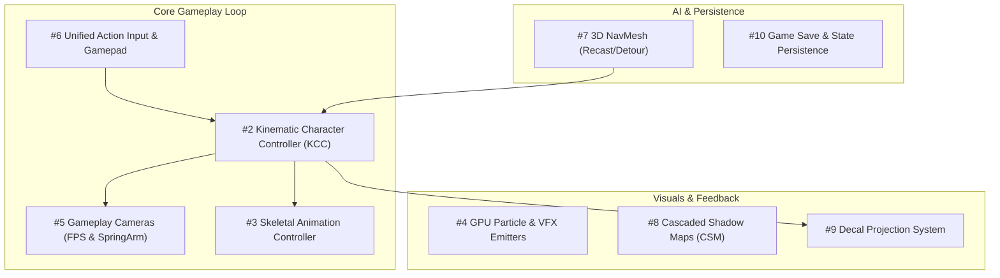

# 041 — Missing Game Engine Features Roadmap

## Purpose

This runbook establishes the architectural analysis, gap assessment, and implementation roadmap for the **top 10 missing game engine features** identified for Triangular Engine.

Triangular Engine possesses advanced capabilities in procedural planetary generation, atmospheric volumetric raymarching, CDLOD quadtree terrain, deterministic ecology, and dual Rapier/Jolt physics. However, when compared against modern 3D game engines (Unity, Godot, Unreal, Babylon.js), foundational gameplay and presentation systems have historically been missing or limited to bare-metal stubs.

This document records:
1. **The Milestone 1 Delivery (2026-10-01)**: Design, implementation, and verification of the **3D Spatial Audio & Audio Bus System** (including camera-based tracking and the `/audio-lab` demo).
2. **The Remaining Missing Engine Features**: Comprehensive architectural specifications, technical feasibility, and template API designs for the remaining 9 features.
3. **Phased Execution Order**: Prioritization matrix connecting physics, gameplay cameras, input, animation, and persistence.

---

## Milestone 1 Delivery: 3D Spatial Audio & Multi-Bus Mixer

*Delivered in session 2026-10-01.*

### Delivered Architecture
- **Multi-Bus Mixing (`AudioService`)**:
  - Standard hierarchical audio channels: `master`, `music`, `sfx`, `ambient`, `voice`, `ui`.
  - Signal-based volume multipliers and mute states.
  - Effective volume computation: $\text{Effective} = \text{Base} \times \text{Bus} \times \text{Master}$ (clamped to 0 when muted).
  - Web Audio API browser autoplay policy resume on first user interaction (`pointerdown`, `keydown`, `touchstart`).
  - One-shot audio API (`playOneShot` for 2D UI/music and `playPositionalOneShot` for 3D world effects).
- **Declarative Angular Components**:
  - `<audioListener>`: Canonical listener representation with `[(masterVolume)]`, custom Biquad filters, and automatic camera tracking.
  - `<positionalAudio>`: 3D spatial sound source wrapping Three.js `PositionalAudio` and Web Audio `PannerNode`, exposing `refDistance`, `maxDistance`, `rolloffFactor`, `distanceModel` (`inverse`, `linear`, `exponential`), and directional sound cones.
  - `<ambientAudio>` / `<audioSource>`: Non-positional 2D audio tracks for BGM, ambient room loops, and UI stings.
- **Active Camera Attachment Fix**:
  - *Problem*: Orbit controls in Triangular Engine operates an internal camera and switches `EngineService.camera$`, leaving stationary outer `<camera>` nodes frozen.
  - *Solution*: `<audioListener>` automatically tracks `EngineService.camera$` via `[attachToActiveCamera]="true"` (default: `true`), keeping the virtual ears locked to the active camera viewpoint across zoom, orbit, and cutscene transitions. Setting `[attachToActiveCamera]="false"` anchors the listener to a player/avatar entity mesh.
- **Demo Page (`/audio-lab`)**:
  - Real-time procedural Web Audio synthesizer (`sound-synthesizer.util.ts`) generating ambient pads, beacon chime loops, synth drones, and laser pings without external asset dependencies.
  - Interactive HUD mixer with bus faders, mute switches, speed sliders, and 3D one-shot triggers.
  - Orbiting sound orb and central beacon demonstrating distance falloff and stereo panning.

### Audio Next Slices (Planned Enhancements)
1. **Low-Pass Filter Audio Occlusion**: Raycasting from active camera/listener to positional sources; applying a `BiquadFilterNode` low-pass frequency cut when occluded by terrain, buildings, or cave geometry.
2. **Audio Voice Pooling**: Pool of reusable `THREE.Audio` and `THREE.PositionalAudio` nodes to prevent garbage collection spikes during rapid weapon fire or particle impacts.
3. **Sound Ducking**: Automated temporary attenuation of `'music'` and `'ambient'` buses when audio triggers on the `'voice'` or `'ui'` buses.

---

## The 9 Remaining Missing Features

Below is the technical evaluation and design specification for the remaining 9 engine pillars.



---

### Feature 2: Kinematic Character Controller (KCC)

* **Problem in Triangular Engine**:
  Currently, entity movement relies directly on raw physics bodies (`<rigidBody>` in Rapier or `<joltRigidBody>` in Jolt). Pushing dynamic bodies with forces or setting linear velocities causes players to jitter on stairs, stick to vertical walls, launch into space when running down slopes, or slide uncontrollably on ramps.
* **What Other Engines Have**:
  Dedicated kinematic character controllers (Unity `CharacterController.Move()`, Godot `CharacterBody3D.move_and_slide()`, Unreal `CharacterMovementComponent`).
* **Technical Strategy**:
  - Both physics backends compiled into Triangular Engine already ship with robust character controllers:
    - Rapier: `World.createCharacterController(offset)` (`KinematicCharacterController`).
    - Jolt: `CharacterVirtual` / `CharacterVirtualSettings`.
  - Wrap these into a high-level Angular component `<characterController>` that handles:
    - Step climbing (walk over obstacles $< 0.35\text{m}$ smoothly).
    - Slope limits (e.g. maximum $45^\circ$, auto-slide on steeper inclines).
    - Ground snapping / down-step snapping (sticking to ramps when descending at speed).
    - Moving platform passenger inheritance (standing on moving elevators/trains).
* **Target Declarative API**:
  ```html
  <characterController
    [stepOffset]="0.35"
    [maxSlopeAngle]="45"
    [groundSnapDistance]="0.2"
    [gravity]="-9.81"
    (groundedChange)="onGroundedChange($event)"
  >
    <mesh>
      <capsuleGeometry [params]="[0.4, 1.8]" />
    </mesh>
  </characterController>
  ```
* **Effort / Feasibility**: **Medium / Very High**.

---

### Feature 3: Skeletal Animation State Machine / Controller

* **Problem in Triangular Engine**:
  The engine loads glTF meshes via `LoaderService`, but has no declarative animation mixer, transition crossfading, or state machine. Playing animations requires imperatively manipulating Three.js `AnimationMixer` and `AnimationAction`s.
* **What Other Engines Have**:
  Mecanim (Unity), AnimationTree / StateMachine (Godot), Animation Blueprints (Unreal).
* **Technical Strategy**:
  - Build an `<animationController>` and `<animationState>` component set wrapping `THREE.AnimationMixer`.
  - Provide declarative crossfades (e.g., smoothly blending from "Idle" to "Walk" over $0.2\text{s}$).
  - Support speed scaling, looping modes, and root motion extraction.
* **Target Declarative API**:
  ```html
  <mesh [gltf]="characterModel()">
    <animationController [activeState]="playerGrounded() ? moveState() : 'jump'">
      <animationState name="idle" clip="Idle" [loop]="true" />
      <animationState name="walk" clip="Walk" [fadeTime]="0.2" [speed]="walkSpeed()" />
      <animationState name="run" clip="Run" [fadeTime]="0.25" [speed]="runSpeed()" />
      <animationState name="jump" clip="Jump_Start" [loop]="false" [clampWhenFinished]="true" />
    </animationController>
  </mesh>
  ```
* **Effort / Feasibility**: **Medium / Very High**.

---

### Feature 4: GPU / Instanced Particle & VFX Emitter System

* **Problem in Triangular Engine**:
  No particle system exists. Explosions, smoke, torch flames, thruster fire, sparks, and spell effects cannot be created without writing custom Three.js shader materials from scratch.
* **What Other Engines Have**:
  Shuriken / VFX Graph (Unity), GPUParticles3D (Godot), Niagara (Unreal).
* **Technical Strategy**:
  - Implement `<particleEmitter>` using `THREE.InstancedMesh` (or GPU point sprites) for maximum web performance (handling $10{,}000+$ particles at 60 FPS).
  - Configurable burst or continuous emission, lifetime range, velocity vectors, gravity modifier, size curves, and color gradients.
  - Local vs. world space simulation modes.
* **Target Declarative API**:
  ```html
  <particleEmitter
    [texture]="'assets/particles/smoke.png'"
    [maxParticles]="2000"
    [rate]="150"
    [lifetime]="[1.0, 2.5]"
    [speed]="[2.0, 5.0]"
    [sizeCurve]="[0.2, 1.5]"
    [colorOverLifetime]="['#ff9800', '#795548', '#212121']"
    [gravity]="[0, 0.5, 0]"
  />
  ```
* **Effort / Feasibility**: **Medium / High**.

---

### Feature 5: Gameplay Camera Rigs (FPS PointerLock & TPS SpringArm)

* **Problem in Triangular Engine**:
  Camera controls are currently centered around editor/inspection tools (`<orbitControls>`, `<raycastOrbitControls>`). There is no built-in First-Person camera (with mouse capture and pitch clamping) or Third-Person camera with anti-clipping spring arm (pulling the camera forward when geometry blocks the player view).
* **What Other Engines Have**:
  Unreal `USpringArmComponent`, Godot `SpringArm3D`, Unity Cinemachine.
* **Technical Strategy**:
  1. `<firstPersonControls>`:
     - HTML5 Pointer Lock API integration.
     - Yaw/Pitch rotation with configurable angle clamps ($\pm 85^\circ$).
     - Mouse sensitivity curves and smoothing.
  2. `<springArm>`:
     - Raycast / Spherecast from target origin to desired camera socket position.
     - Queries Rapier/Jolt or Three.js raycasting to detect obstructing terrain, walls, and obstacles.
     - Smooth spring-back dampening when moving away from obstacles.
* **Target Declarative API**:
  ```html
  <!-- Third-Person Spring Arm Rig -->
  <mesh [position]="playerPos">
    <springArm
      [targetOffset]="[0, 1.6, 0]"
      [armLength]="4.5"
      [collisionMask]="COLLISION_ENVIRONMENT"
      [probeRadius]="0.2"
    >
      <camera />
      <audioListener />
    </springArm>
  </mesh>
  ```
* **Effort / Feasibility**: **Low–Medium / Very High**.

---

### Feature 6: Unified Action Input Mapping & Gamepad / Touch

* **Problem in Triangular Engine**:
  `EngineInputService` is hardcoded to raw keyboard key strings and mouse client coordinates. There is no controller (Gamepad API) support, deadzone filtering, action abstraction, or touch virtual joystick for mobile/tablet devices.
* **What Other Engines Have**:
  Unity Enhanced Input System, Godot `InputMap`, Unreal Enhanced Input.
* **Technical Strategy**:
  - Implement Action Mapping: Developers bind abstract actions (`'MoveForward'`, `'Jump'`, `'Interact'`) to multiple physical inputs (Keyboard `KeyW`, Gamepad `Axis_LeftStick_Y`, Touch Joystick).
  - Gamepad API polling in `EngineService.tick$` with radial deadzone and sensitivity curves.
  - `<virtualJoystick>` and `<virtualButton>` HUD overlay components built using `@angular/cdk/portal` or template layout.
* **Target TypeScript API**:
  ```ts
  this.input.registerAction('Jump', [
    { device: 'keyboard', code: 'Space' },
    { device: 'gamepad', button: 0 }, // 'A' on Xbox / 'X' on PS
  ]);

  this.input.registerAxis2D('Move', [
    { device: 'keyboard', up: 'KeyW', down: 'KeyS', left: 'KeyA', right: 'KeyD' },
    { device: 'gamepad', stick: 'left', deadzone: 0.15 },
  ]);
  ```
* **Effort / Feasibility**: **Low–Medium / Very High**.

---

### Feature 7: 3D NavMesh Generation & Agent Pathfinding (Recast / Detour)

* **Problem in Triangular Engine**:
  The existing `triangular-engine/navigation` sublibrary is restricted to a 2D heightfield grid on terrain. It cannot represent or navigate multi-story buildings, bridges, overhangs, staircases, tunnels, or indoor geometry.
* **What Other Engines Have**:
  Unity NavMesh, Godot `NavigationServer3D`, Unreal NavMesh (Recast/Detour).
* **Technical Strategy**:
  - Integrate `recast-navigation-js` (WASM build of industry-standard Recast / Detour).
  - Offload NavMesh voxelization and polygon baking to a Web Worker to avoid blocking the main thread.
  - Provide `<navMeshAgent>` component that consumes path corridors, executes string-pulling (funnel algorithm), and handles obstacle avoidance (RVO / ORCA).
* **Target Declarative API**:
  ```html
  <scene>
    <navMesh [meshes]="walkableMeshes" [cellSize]="0.2" [agentHeight]="1.8" />

    <mesh [position]="npcPosition">
      <navMeshAgent [target]="playerPos" [speed]="3.5" (destinationReached)="onArrived()" />
    </mesh>
  </scene>
  ```
* **Effort / Feasibility**: **Medium–High / High**.

---

### Feature 8: Cascaded Shadow Maps (CSM) & Expanded Lighting — [COMPLETED]

* **Status**: Delivered (2026-10-03).
* **Delivered Architecture**:
  - Implemented `<csm>` (`CsmComponent`) in `projects/triangular-engine/src/lib/engine/components/light/csm/` wrapping Three.js's integrated `CSM` (`three/examples/jsm/csm/CSM.js`).
  - Implemented `EngineCSM` safely composing with preexisting `material.onBeforeCompile` chains (preserving wind, dither, impostor hooks) and ref-counting shared material registrations.
  - Implemented `calculateCsmAdaptiveRange` providing altitude-adaptive shadow scaling for spherical planets with smooth fade into native day/night terminators.
  - Implemented `[csmReceiver]` (`CsmReceiverDirective`) enabling selective mesh shadow opt-in/opt-out.
  - Built interactive `/csm-lab` showcase page comparing standard single-frustum shadows side-by-side with 1–4 depth cascades and live frustum debug visualization (`CSMHelper`).
* **Target Declarative API**:
  ```html
  <csm
    [lightDirection]="[-1, -1.5, -1]"
    [intensity]="3.0"
    [cascades]="4"
    [maxDistance]="450"
    [mode]="'practical'"
    [fade]="true"
    [debug]="showFrustums()"
  />
  ```
* **Documentation**: See `projects/triangular-engine/docs/shadows.md`.

---

### Feature 9: Decal Projection System

* **Problem in Triangular Engine**:
  There is no way to paint or project local details onto existing terrain and static meshes. Bullet holes, vehicle skid marks, blood splatters, footprints, and blast scorches cannot be rendered without altering base mesh textures.
* **What Other Engines Have**:
  Decal Projectors (Unity Decal Projector, Godot `Decal`, Unreal Decal).
* **Technical Strategy**:
  - Wrap `three/addons/geometries/DecalGeometry.js`.
  - Provide both a declarative component (`<decal>`) and an imperative service method (`DecalService.project(mesh, position, orientation, size)`).
  - Automatically manage decal lifespans and pool instances with alpha fade-out.
* **Target Declarative API**:
  ```html
  <decal
    [targetMesh]="wallMesh"
    [position]="hitPoint"
    [normal]="hitNormal"
    [size]="[0.4, 0.4, 0.2]"
    [material]="bulletHoleMaterial"
    [fadeAfterSeconds]="15"
  />
  ```
* **Effort / Feasibility**: **Low–Medium / Very High**.

---

### Feature 10: Game Save & State Persistence Framework

* **Problem in Triangular Engine**:
  `Dexie` (IndexedDB) is already an installed dependency in the workspace, but is only used for engine debug settings. There is no structured API for games to save/load player state, world alterations, inventory, or checkpoints.
* **What Other Engines Have**:
  Unreal `SaveGame`, Unity serialization frameworks, Godot state serialization.
* **Technical Strategy**:
  - Build `SaveGameService` backed by IndexedDB.
  - Components register state hooks via an interface:
    `saveService.registerParticipant('player', { serialize: () => ({ x, y, z, hp }), deserialize: (data) => ... })`.
  - Support multiple named slots, timestamps, auto-save triggers, and schema migrations.
* **Target TypeScript API**:
  ```ts
  @Injectable()
  export class GameFlowService {
    readonly save = inject(SaveGameService);

    async quickSave(): Promise<void> {
      await this.save.saveSlot('quicksave', { label: 'Sector 4 - Bunker' });
    }

    async loadGame(slotName: string): Promise<void> {
      await this.save.loadSlot(slotName);
    }
  }
  ```
* **Effort / Feasibility**: **Low / Very High**.

---

## Phased Execution Roadmap

| Phase | Milestone | Features Included | Primary Deliverable |
|:---:|---|---|---|
| **M1** | **Audio & Acoustics** *(Completed)* | #1 3D Spatial Audio & Mixer | Core Audio Engine & `/audio-lab` demo |
| **M2** | **Core Character & Controls** | #2 KCC, #5 Gameplay Cameras, #6 Input Action System | First-person & third-person playable character demo |
| **M3** | **Animation & Visual Feedback** | #3 Skeletal Animation, #4 GPU Particles, #9 Decals | Animated glTF avatar with weapon VFX and impact decals |
| **M4** | **Lighting & 3D Navigation** | #8 Cascaded Shadow Maps, #7 3D Recast NavMesh | Multi-level building demo with CSM shadows & AI navigation |
| **M5** | **Game State & Persistence** | #10 Game Save & State Framework | Save/load slots, persistence across page refreshes |

---

## Verification & Architecture Guidelines

When implementing any feature from this roadmap:
1. **Preserve Sublibrary Reusability**: Core components belong in `triangular-engine`; specialized features should live in existing sublibraries or well-defined new secondary entry points (per `024_sublibrary_reusability_boundaries.md`).
2. **Follow Angular 19 Signal Paradigms**: Use `signal()`, `input()`, `model()`, and `effect()` for reactive engine synchronization.
3. **Colocated Unit Tests**: Maintain $>95\%$ branch test coverage on all new services and components (`*.spec.ts`).
4. **Interactive Demo Page**: Provide a dedicated demo page in `projects/demo-app/` with HUD controls, preset selectors, and real-time visual feedback.
5. **No Git Commits**: Never execute `git commit` in the shared workspace per repository instructions.
